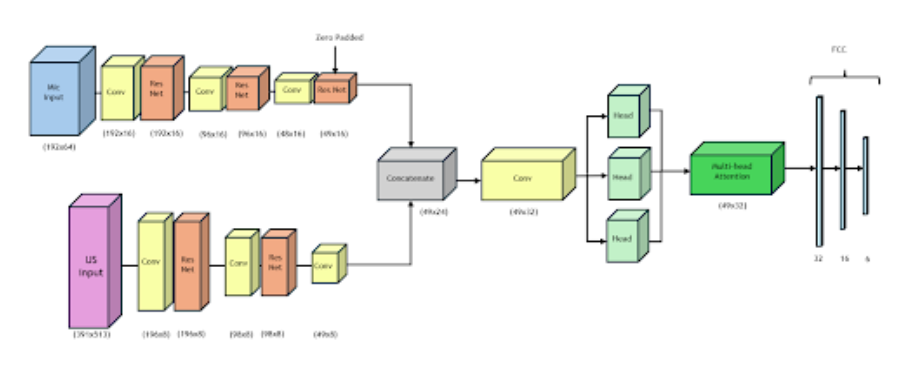
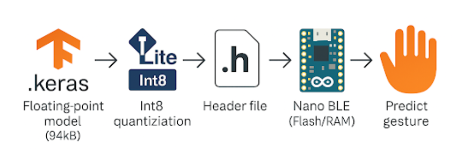
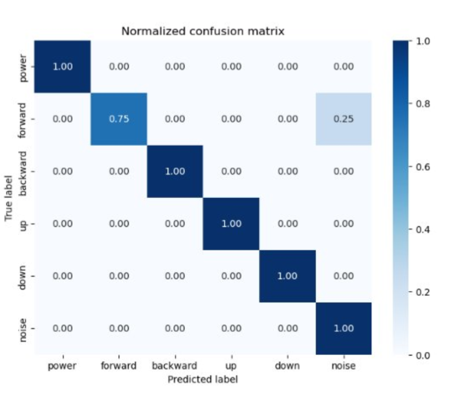
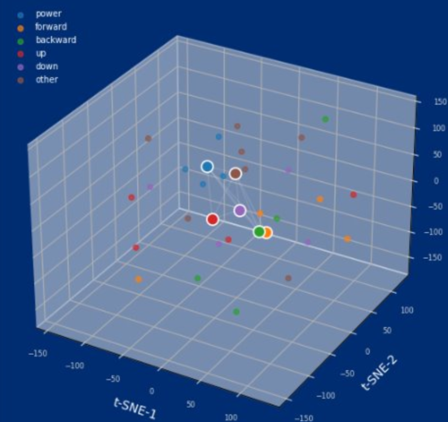
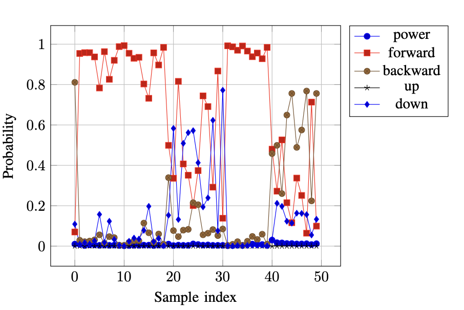

# Dual Channel Fusion of Passive-Active Acoustic Cues for Intent Detection

A multimodal gesture recognition system that fuses **passive microphone** audio (25 kHz) and **active ultrasound** reflections (100 kHz) to classify arm/hand gestures for intent detection. The ultrasound sensor acts like sonar, emitting pulses and listening for reflections from hand movements, while the microphone captures accompanying audio cues. The model runs on-device on an **Arduino Nano BLE** via TFLite int8 quantization.

**Gestures recognized:** `power` · `forward` · `backward` · `up` · `down` · `noise`

---

## Architecture



---

## End-to-End Deployment Pipeline



---

## Results

### Confusion Matrix



### 3D t-SNE of Learned Embeddings



### Real-Time Inference Output



---

## Repository Structure

```
├── utils.py                        # Feature extraction, dataloader, model definition
├── notebooks/
│   ├── 01_train_resnet_fusion.ipynb       # ResNet fusion model (5-class)
│   ├── 02_train_lightweight_resnet.ipynb  # Lightweight ResNet (6-class + noise)
│   ├── 03_train_micro_lstm.ipynb          # Micro LSTM model (~15K params)
│   └── 04_finetune.ipynb                  # Fine-tuning on new speaker
├── preprocessing/
│   ├── resample_mic.m              # MATLAB: chunk mic .dat → .mat files
│   └── resample_us.m               # MATLAB: chunk ultrasound .dat → .mat files
├── models/
│   └── resnet_fusion_model_light_int8.tflite   # Quantized model for deployment
└── example_data/
    ├── mic/                        # Sample mic chunks (2 per gesture, .mat)
    └── us/                         # Sample ultrasound chunks (2 per gesture, .mat)
```

---

## Setup

```bash
pip install tensorflow numpy scipy matplotlib
```

MATLAB R2021a+ required for the preprocessing scripts.

---

## Usage

### 1. Preprocess raw sensor data (MATLAB)

Run `preprocessing/resample_mic.m` on your `*COM03*.dat` files (microphone) and `preprocessing/resample_us.m` on your `*COM04*.dat` files (ultrasound). This trims, resamples, and chunks the recordings into 2-second `.mat` files.

Expected output directory structure:
```
data/
  Mic/CHUNKS/<gesture>_chunks/TimeSeriesMic_<gesture>_<subject>_chunk01.mat
  US/CHUNKS/<gesture>_chunks/TimeSeriesUS_<gesture>_<subject>_chunk01.mat
```

### 2. Train the model

Open `notebooks/01_train_resnet_fusion.ipynb` and update the data paths:

```python
train_mic, train_us, train_labels, test_mic, test_us, test_labels = load_data(
    mic_dir="data/Mic/CHUNKS",
    us_dir="data/US/CHUNKS"
)
```

`utils.py` contains the full feature extraction pipeline (`mic_mel_spec_tf`, `us_bandpassed_spec_tf`) and `tf_dataloader`.

### 3. Run inference on example data

```python
import scipy.io as sio
import numpy as np
import tensorflow as tf
from utils import mic_mel_spec_tf, us_bandpassed_spec_tf

labels = ["power", "forward", "backward", "up", "down", "noise"]
model = tf.keras.models.load_model("path/to/model.keras")

mic_sig = sio.loadmat("example_data/mic/TimeSeriesMic_power_unnathi_chunk02.mat")["x_chunk"].squeeze()
us_sig  = sio.loadmat("example_data/us/TimeSeriesUS_power_unnathi_chunk02.mat")["x_chunk"].squeeze()

mic_spec = np.expand_dims(mic_mel_spec_tf(mic_sig.astype("float32")).numpy(), 0)
us_spec  = np.expand_dims(us_bandpassed_spec_tf(us_sig.astype("float32")).numpy(), 0)

pred = model.predict([mic_spec, us_spec])
print("Predicted:", labels[np.argmax(pred)])
```

### 4. Fine-tune on a new speaker

Use `notebooks/04_finetune.ipynb`. Loads the pretrained model and continues training on new subject data with the same pipeline.

---

## Data Format

Each `.mat` file contains one variable `x_chunk`, a 1D float array of a 2-second audio segment.

- **Mic:** 25 kHz → 50,000 samples/chunk
- **Ultrasound:** 100 kHz → 200,000 samples/chunk

Filename convention: `TimeSeriesMic_<gesture>_<subject>_chunk<NN>.mat`

---

## Hardware

- **Microphone (passive):** standard audio mic, COM3, 25 kHz sampling
- **Ultrasound sensor (active):** 40 kHz transducer, COM4, 100 kHz sampling
- **Inference board:** Arduino Nano BLE Sense
